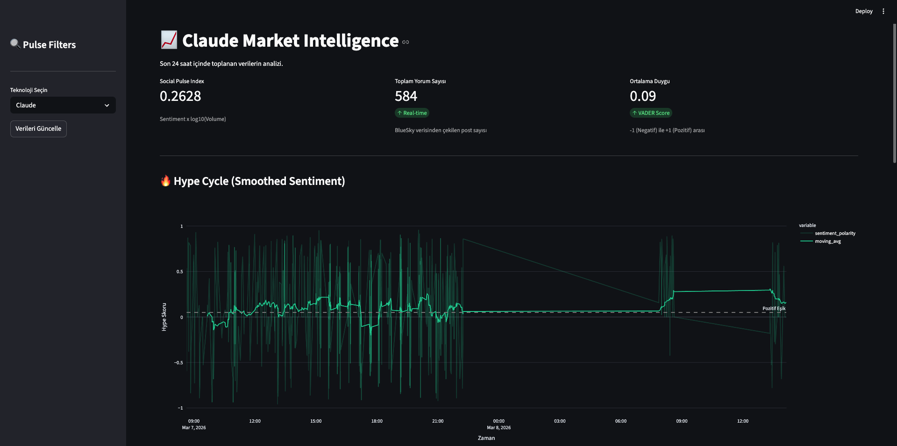
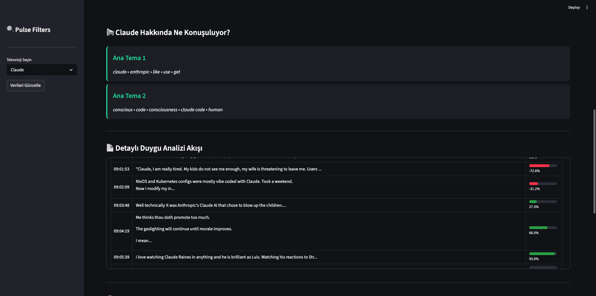
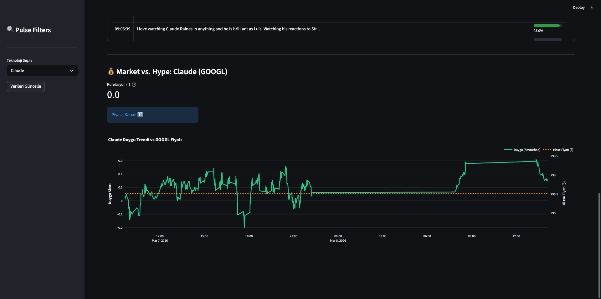

# 🚀 Social Pulse: Tech Market Intelligence Dashboard

**Social Pulse** is an end-to-end project that analyzes real-time social media sentiment from **BlueSky** and correlates it with tech stock prices using **NLP** and **Statistical Analysis**.





---
## 🛠️ Project Architecture
This project implements a complete ETL pipeline:
1.  **Data Ingestion:** Real-time stream from BlueSky API and financial data from Yahoo Finance.
2.  **Storage:** Relational data modeling using **PostgreSQL**.
3.  **Analytics Engine:** * **VADER Sentiment Analysis** for emotional polarity.
    * **LDA (Latent Dirichlet Allocation)** for unsupervised topic modeling.
    * **Pearson Correlation** ($r$) to find the link between social hype and stock volatility.
4.  **Visualization:** Interactive dashboard built with **Streamlit** and **Plotly**.

---

## 🧠 Key Engineering Features

### 1. The "Pulse Index" Algorithm
Instead of simple averages, I developed a custom metric to weigh sentiment by volume:
$$Pulse = \text{Sentiment}_{\text{avg}} \times \log_{10}(\text{Volume} + 1)$$

### 2. Topic Deduplication
The analytics engine uses a custom word-filtering logic to ensure that AI-generated topics do not overlap, providing cleaner insights into what people are actually talking about.

### 3. Time-Series Synchronization
Utilizes `pd.merge_asof` for high-precision temporal alignment between irregular social media timestamps and periodic stock market data.

---

## 💻 Tech Stack
- **Language:** Python 3.11
- **Database:** PostgreSQL
- **Libraries:** Pandas, NumPy, Scikit-learn, NLTK, Streamlit, Plotly, Psycopg2.

---

## 🚀 Getting Started

### Prerequisites
- Python 3.11+
- PostgreSQL instance
- BlueSky API Credentials

### Installation
1. Clone the repository:
   ```bash
    git clone [https://github.com/emirtsn/social-pulse.git](https://github.com/emirtsn/social-pulse.git)
    cd social-pulse
    python -m venv venv
    source venv/bin/activate
    pip install -r requirements.txt

2. Configuration
- Create a **config.py** file in the root directory:
    
    ```bash
    DB_CONFIG = {
        "host": "localhost",
        "database": "your_db",
        "user": "your_user",
        "password": "your_password"
    }
    BSKY_CREDENTIALS = {"handle": "your_handle", "password": "your_app_password"}
    
3. Run the Platform 
     ```bash
   streamlit run app.py
   